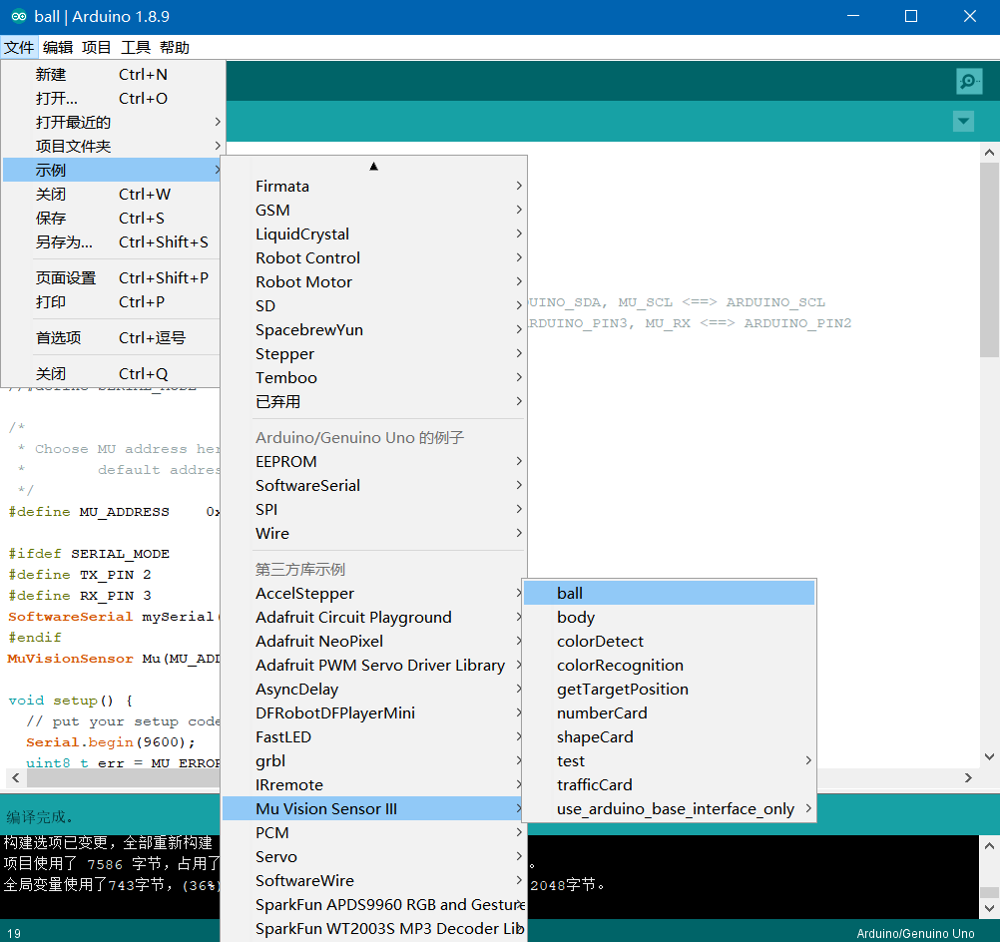

# Arduino库导入

在Arduino官网下载最新的Arduino IDE 1.8.9

<https://www.arduino.cc/en/Main/Software?setlang=cn>

在github下载最新的MUVisionSensorIII的Arduino库

<https://github.com/mu-opensource/MuVisionSensorIII>

按照默认路径安装Arduino IDE，则Arduino的第三方库在“文档\Arduino\libraries”文件夹下。

将下载的MUVisionSensorIII-1.1.6解压后放入该文件夹则完成导入。

打开Arduino IDE，选择顶部的“工具 - 开发板”，常用开发板为Arduino Uno。如果使用MoonBot主控，则选开发板为Arduino Mega 2560，

并选择处理器为ATmega 1280。连接开发板后选择相应端口则完成Arduino开发板的连接。

如果成功导入了开发板兼容的库，选择顶部的“文件 - 示例 - 第三方示例 - MU Vision Sensor III”可以打开官方示例程序。

# Arduino硬件连接

MU Vision Sensor 3的外设和接口如图所示：

## I2C模式

1）将模块左侧输出模式拨码开关1拨至下方，2拨至上方，切换至I2C模式；

2）（不推荐修改此设置）将模块右侧的地址选择拨码开关拨至对应位（默认地址0x60，1、2都在下方）；

3）将模块输出接口SDA口接至Arduino对应的SDA口，SCL口接至Arduino对应的SCL口。

## 串口模式

1）将模块左侧输出模式拨码开关1、2都拨至下方，切换至串口模式；

2）（不推荐修改此设置）将模块的地址选择拨码开关拨至对应位（默认地址1、2都在下方）；

3）将模块输出接口RX口接至Arduino对应的TX口，TX口接至Arduino对应的RX口。

# 示例说明

ball

body

colorDetect

colorRecognition

getTargetPosition

numberCard

shapeCard

trafficCard

arduino_base_interface

# FAQs

1.Q:导入库后无法打开模块或模块都是黑框怎么办？

A:请下载最新版Mixly程序，重新导入后即可。

2.Q:我正确导入了库，下载了例程，但是模块没有反应，串口也没有任何输出怎么办？

A:检查接线是否正确，是否有接触不良的现象。

检查模块背后的白灯是否常量，白灯不亮则表示电源口没有电压或电源线接线错误。

检查输出模式拨码开关和地址选择拨码开关是否是拨至正确位置。

模块从上电到初始化完成需要一段时间，建议在“设置”模块前加入一段不小于500ms的延时。

点击模块Reset按钮，模块正面两个LED会短暂闪烁一次光。红光则表示当前模式为串口模式，绿光则表示当前模式为I2C模式。若光的颜色与输出模式拨码开关不符，则可能为拨码开关松动，重新拨动拨码开关至正确位置即可。

3.Q:我下载了程序，串口有正确的内容输出，但是LED灯光不亮怎么办？

A:当算法为颜色识别算法时，程序默认会关闭LED，防止LED灯光照射使物体偏色。

在设置中打开LED灯光，调节灯光亮度>0。

4.Q:按我对比了文档和Mixly库，发现有些功能Mixly库没有怎么办？

A:为了使库易于理解和操作，在Mixly库中去除了一些不常用的功能，A:简化了一些参数的设置方式。若这些省去的功能影响到了您的项目，请发邮件至摩图科技售后：support@morpx.com寻求技术支持和解决方案。

5.Q:我发现烧录前一次程序的算法会对后一次程序的算法有影响，如：前一次烧录了颜色识别算法，后一次烧录球算法，就算没有识别到球LED也会显示识别到，而只烧录球算法则没有这种现象，怎么办？

A:这是因为前一种算法在程序结束后并没有被关闭导致的，可以在设置模块时加入“恢复默认设置”模块，或重新断电拨插模块即可。
