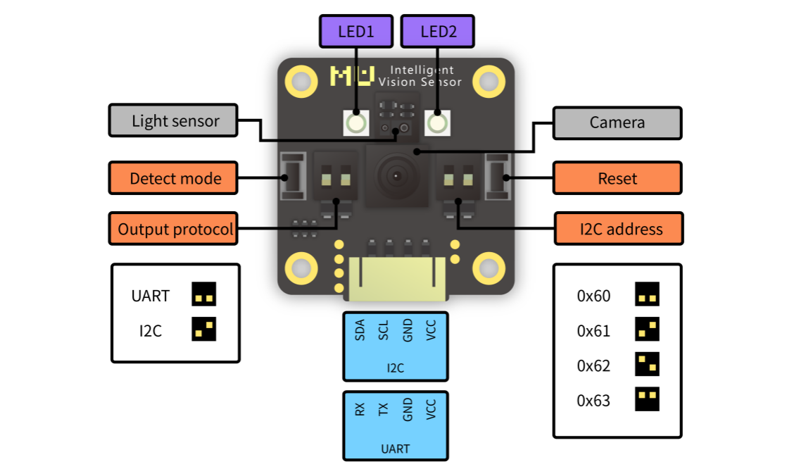
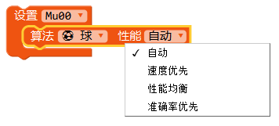
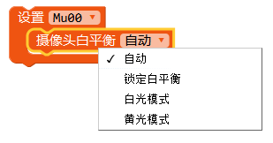
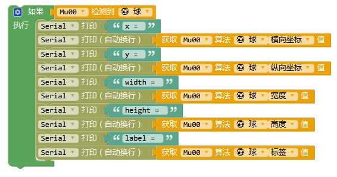

# 配置Mu Editor和Micro:bit
Mu Editor是一款具有友好GUI界面的MicroPython集成开发工具，包含了代码编辑、烧录、REPL终端、串口绘图器等功能。通过Micro:bit主板控制小MU视觉传感器，需要使用包含了MuVisionSensor传感器的MicroPython固件，请按以下步骤进行设置：

（1）下载Micro:bit固件：

GitHub：<https://github.com/mu-opensource/MuVisionSensorIII-MicroPython>

morpx官网：<http://mai.morpx.com/page.php?a=sensor-support>

（2）更新Micro:bit固件：

将Micro:bit通过USB线连接电脑，出现Micro:bit的磁盘，将下载的固件microbit-micropython-MuVisionSensor-0.8.0.hex 文件拖入磁盘中，Micro:bit将自动更新固件并重启。

（3）下载并安装Mu Editor：<https://codewith.mu/>

（4）导入传感器

打开Mu Editor，在顶部选择模式为 BBC micro:bit，连接micro:bit后左下角显示“连接到新的micro:bit 设备”即可进行编程。单击顶部REPL按钮进入串口实时模式，micro:bit将返回固件版本信息。输入：

```python
>>>from MuVisionSensor import *
```

导入传感器后即可使用MuVisonSensor类中的所有公开API

*MuVisionSensor传感器中关键字的自动补全仅在REPL模式下可用



# Micro:bit硬件连接

MU Vision Sensor 3的外设和接口如图所示：


（1）将传感器左侧输出模式拨码开关1拨至下方，2拨至上方；

（2）将传感器输出接口SDA引脚（P1）和SCL引脚（P2）接至Micro:bit 对应的 SDA引脚（P20）与SCL引脚（P19），同时将P3接地，P4接电源（3.3-5V）；

（3）将传感器的地址选择拨码开关拨至对应位（默认地址0x60则 1、2都在下方，不推荐修改此设置）。

*目前仅支持I2C模式

# API使用说明

**初始化传感器**

1.调用MuVisionSensor(adress)创建一个对象mu，并指定传感器地址，指定的地址要与地址选择拨码开关的设置保持一致

2.调用begin()函数，启动传感器

**开启算法**

API：

```python
MuVisionSensor.VisionBegin(vision_type)
```

目前支持的vision_type有：

| vision_type                | 算法名称     |

| -------------------------- | ------------ |

| VISION_COLOR_DETECT        | 颜色检测     |

| VISION_COLOR_RECOGNITION   | 颜色识别     |

| VISION_BALL_DETECT         | 球体检测     |

| VISION_BODY_DETECT         | 人体检测     |

| VISION_SHAPE_CARD_DETECT   | 形状卡片检测 |

| VISION_TRAFFIC_CARD_DETECT | 交通卡片检测 |

| VISION_NUM_CARD_DETECT     | 数字卡片检测 |

| VISION_ALL                 | 开启所有算法 |

```python
from MuVisionSensor import *  #导入
.... #省略初始化过程
mu.VisionBegin(VISION_COLOR_DETECT)  #开启颜色检测算法
mu.VisionBegin(VISION_SHAPE_CARD_DETECT | VISION_BALL_DETECT) #同时开启形状卡片检测和球体检测算法
```

**设置算法性能**

不同算法性能下识别的速度与准确率会有所差异，可根据实际的应用需要选择合适的性能参数。

速度优先：简单环境下使用，识别速度快，误报率稍高；

性能均衡：默认模式；

准确率优先：复杂场景情况下使用，识别速度稍慢，误报率低；当多类识别算法同时开启时，譬如形状卡片与交通卡片混合摆放识别时，请采用该模式，以消除不同组卡片间的误报。



**设置摄像头帧率模式**

默认使用高帧率模式，相对普通模式有更快的识别速度，但功耗和发热量随之增加，可用于快速检测的场景，如需要低功耗使用则可关闭。


**设置摄像头白平衡**

当摄像头视野中出现大面积有颜色的物体时，摄像头会发生白平衡失真，产生偏色现象，通过事先锁定白平衡能够防止此问题的发生。在调用此编程模块时，需要将摄像头朝向白纸距离约20厘米进行测光，数秒后摄像头的白平衡会自动被锁定。



**设置摄像头数码变焦**

数码变焦等级越大可检测的距离越远，但视野范围会变窄。

数码变焦等级1(距离近,视野广)~数码变焦等级5(距离远,视野窄)。

针对不同距离的物体通过试验测试合理设置数码变焦等级值可以取得较好的识别效果。


**板载LED灯光设置**

小MU视觉传感器正面板载的两颗LED灯每闪烁一次表示执行一帧图像识别。

可通过设置识别到目标与未识别到目标时灯光的颜色来获得反馈。

默认设置：未检测到闪红灯，检测到则闪蓝灯。当进行颜色识别时，默认LED关闭。


**恢复模块默认设置**

关闭所有算法，重置所有硬件设置


**获取算法识别结果**

(1)球体与人体检测
初始程序：采用I2C连接，启用球体检测算法，其余设置为默认。

循环程序：如果视觉传感器检测到球，会通过I2C向Micro:bit发送检测到的数据，Micro:bit会通过串口向电脑发送检测到的信息，否则循环显示未检测到球，人体检测同理。

实验现象：未检测到球则视觉传感器闪红灯，控制台显示”ball undetected”。检测到球则视觉传感器闪蓝灯，控制台显示返回的坐标等信息。


