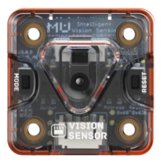
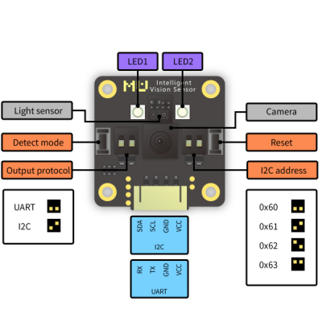

# 视觉模块

## 简介

视觉模块是一个带有特定视觉算法的识别模块。

模块与主控之间通过串口连接，也可通过wifi连接手机端app实现远程编程功能。

## 参数

尺寸：37 x 37 x 15 mm

主控芯片：ESP32

摄像头：OV7725

视角：85°

板载资源：按键、LED指示灯

连接方式：UART、wifi

接口：PH2.0 4P

**接口图:**

## 使用示例

x
