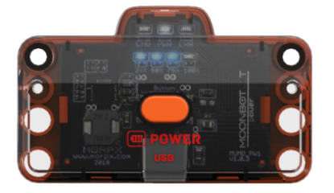
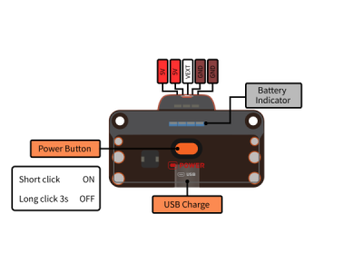

# 电池模块

## 简介

电池模块用于主控供电，可驱动各类执行器和传感器，最大输出功率可达14W。

模块含有锂电池电压转换、电量管理、过载保护、充电等单元，可直接通过USB type-c接口充电（不可传输数据）。

## 参数

尺寸：67.6 x 56 x 33.7 mm

电池类型：聚合物锂电池

电量：7.4V 1800mAh

输出功率：最大5V 2.8A

输出接口：PH2.0 5P

充电功率：最大5V 1A

充电时间：约3.5小时

充电接口：USB type-C

**接口图：**

## 使用示例

x
