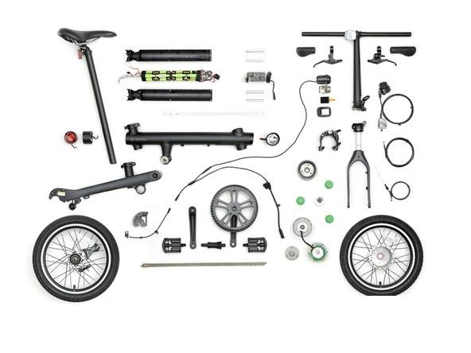

# 3D打印机结构

FDM 3D打印机的常见结构有笛卡尔xyz型、delta三角洲、机械臂型（SCARA、码垛、六轴等）的形式。  
笛卡尔机型是最常用的结构形式，类似于普通的机床，结构简单且稳定。  
整体外形上有箱式结构、龙门式结构、单悬臂结构等。  

xy平面结构上有普通直接式、corexy、ultimaker型等。  

DLP/LCD光固化3D打印机只需要一个z轴移动和固化灯，结构较为简单，主要考验软件和材料。

SLA/SLS常用作工业使用，设备几十万到几百万，精度高，用未来工厂等云平台打样比较合适。

## 总体结构

机械臂包含了底盘、主转臂、副转臂、三角连接架、前转臂和3副连接杆等组件

首先介绍底盘组件

## 底盘组件

底盘部分由上下两部分组成
